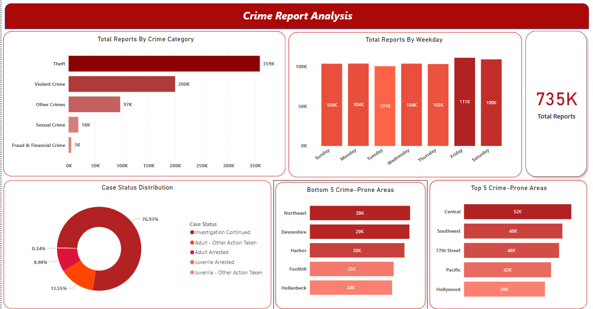
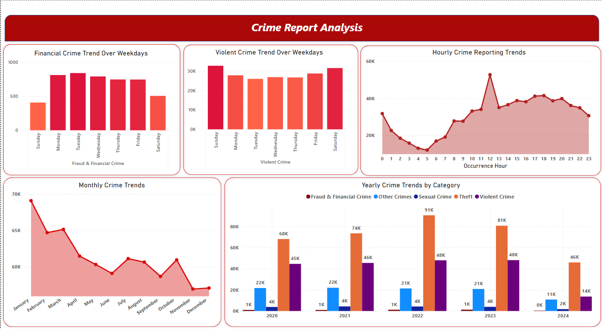
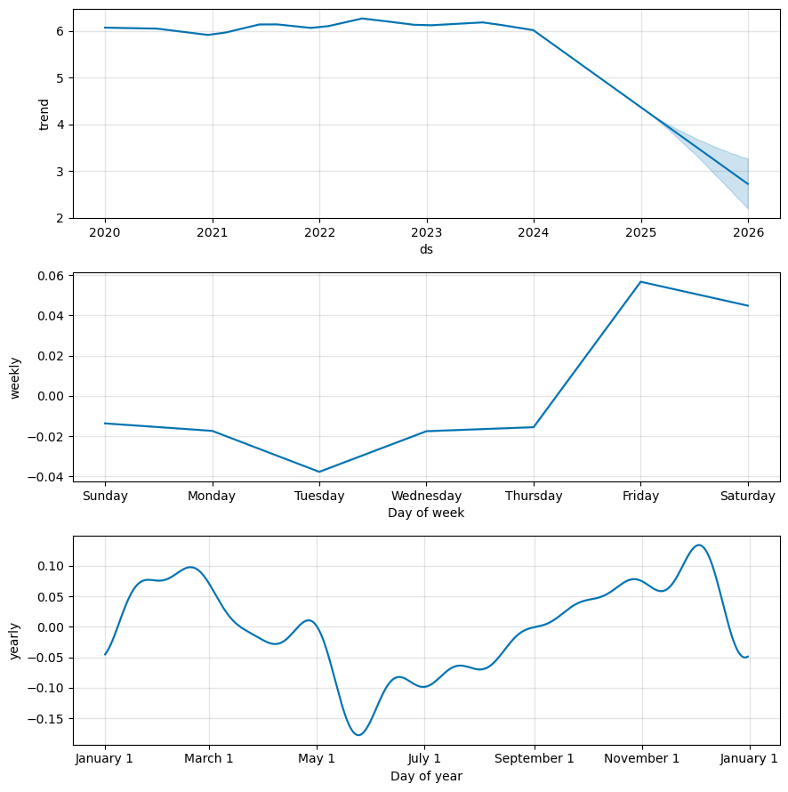
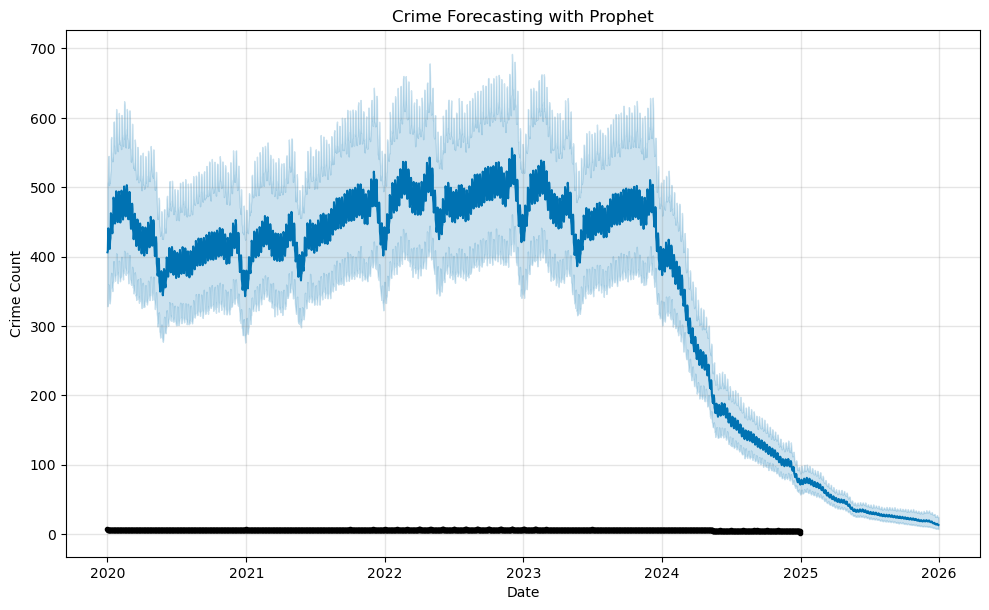

# LAPD-Crime-Analysis-and-Prediction

## Overview

This project analyzes crime data reported by the **Los Angeles Police Department (LAPD)** using publicly available datasets from **data.gov**. It provides insights into crime patterns, trends over time, and victim demographics through **data visualization and SQL-based queries**.

## Screenshots

### Crime Overview Dashboard


### Crime Trends & Reporting Patterns


### Victim Demographics & Crime Characteristics


### Prophet Model – Component Analysis


### Crime Forecasting with Prophet



## Features

- **Crime Trend Analysis:** Monthly, yearly, and weekday crime patterns.
- **Crime Category Insights:** Breakdown of crime types (Theft, Violent Crimes, Fraud, etc.).
- **Peak Crime Hours:** Identifies the most common crime occurrence times.
- **Geographical Crime Distribution:** Top and bottom crime-prone areas in LA.
- **Case Status Insights:** Investigation status distribution of reported crimes.
- **Victim Demographics:** Analysis by age, gender, and ethnic background.
- **SQL Query Outputs:** Optimized queries to extract meaningful crime statistics.

## Dataset

- **Source:** [Crime Data from 2020 to Present](https://catalog.data.gov/dataset/crime-data-from-2020-to-present)
- **Data Processed From:** `processed_bi` table (cleaned and structured data for analysis)

## Tech Stack

- **Jupyter Notebook** (Data Processing - `bi_data_processing.ipynb`)
- **SQL** (Data Extraction - `queries.sql`)
- **Python** (Data Analysis & Visualization)
- **Power BI** (Dashboard Representation)

## Folder Structure

```
crime-analysis-and-prediction/
│── dashboard_screenshot/
│   ├── Crime Overview.png
│   ├── Trends & Patterns Over Time.png
│   ├── Victim Analysis & Reporting Behavior.png
│
│── dashboards/
│   ├── crime_dashboard.pbix
│
│── data/
│   ├── processed_bi.zip
│   ├── raw_data.zip
│
│── notebooks/
│   ├── bi_data_processing.ipynb
│
│── sql_queries/
│   ├── queries.sql
│   ├── query_outputs.pdf
│
│── time_series_analysis/
│   ├── dataset_crime_count.csv
│   ├── time_series_analysis.ipynb
│
│── README.md
```

## Data Processing & Cleaning

Data processing was performed in **`bi_data_processing.ipynb`**, including:

- **Data Cleaning**: Removing null values, formatting timestamps, and renaming columns.
- **Categorization**: Grouping crimes into **Theft, Violent Crimes, Sexual Crimes, Fraud, and Other**.
- **Date Handling**: Converting `date_of_occurrence` into proper `datetime` format.
- **Geospatial Data**: Mapping crime locations using latitude and longitude.

## Time Series Analysis & Prediction

**`time_series_analysis.ipynb`** contains crime forecasting using **Facebook Prophet**:

- **Crime Data Aggregation**: Aggregating crime counts per day.
- **Preprocessing**: Handling missing values and applying log transformations.
- **Model Training**: Fitting **Facebook Prophet** for time-series forecasting.
- **Future Predictions**: Generating **365-day crime forecasts**.
- **Visualization**: Plotting crime trends and seasonal patterns.

## Visualizations

Key insights are displayed using **interactive dashboards** (Power BI/Tableau). Some examples include:

- **Total Reports by Crime Category**
- **Total Reports by Weekday**
- **Case Status Distribution**
- **Crime Trends Over Time** (Yearly, Monthly, Hourly Analysis)
- **Crime Victim Analysis**


